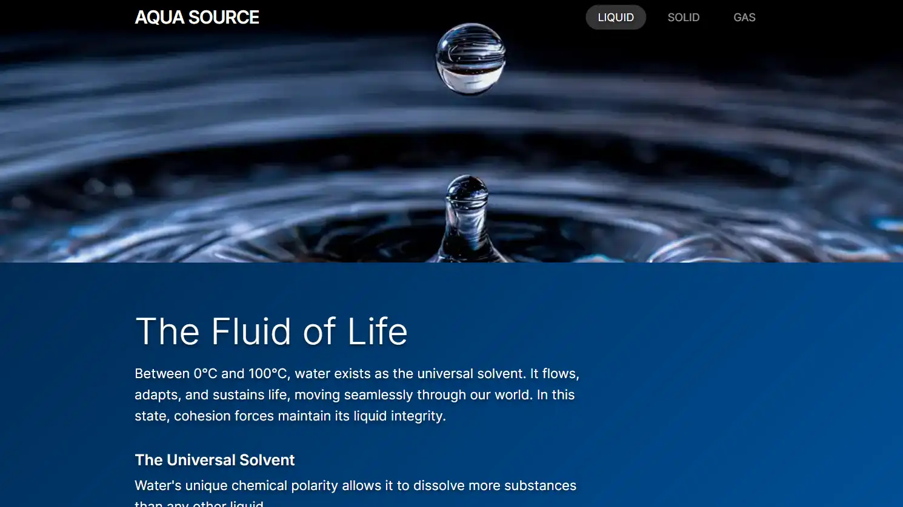
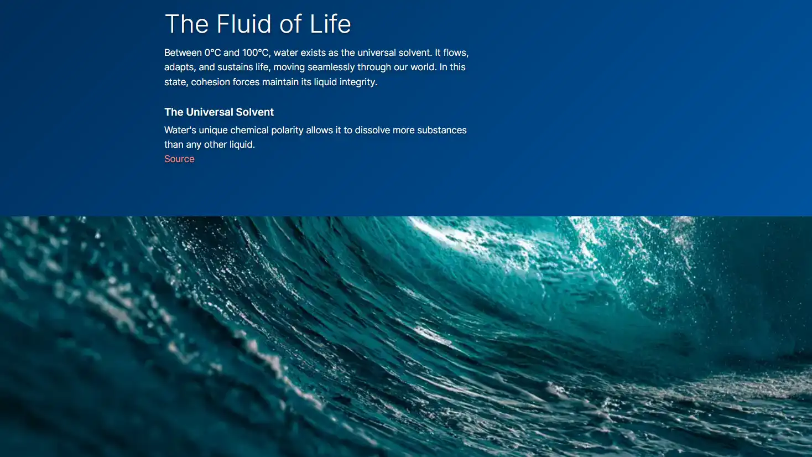

# Aqua Source

 
  

Minimalist 3-page website exploring the three states of water. Created with HTML, CSS, JavaScript.

Site published at https://mantodinas.github.io/source-element/index.html

Created by Mantas Petrauskas 
more projects https://github.com/mantodinas

